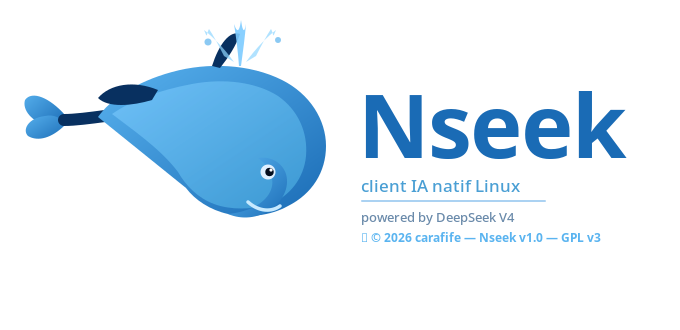

# Nseek — Client IA natif GTK4 pour Linux

<p align="center">
  
</p>

<p align="center">
  
  
  
  
  
</p>

<p align="center">
  <strong>Nseek</strong> est un client IA natif GTK4 pour Linux, conçu pour interagir avec l'API <a href="https://platform.deepseek.com">DeepSeek V4</a> directement depuis le bureau GNOME — sans navigateur, sans Electron, 100% natif.
</p>

---

## ✨ Fonctionnalités

### 💬 Chat IA
- Streaming temps réel des réponses
- **Mode Thinking** — raisonnement interne du modèle visible
- Détection et rendu des **blocs de code** avec coloration syntaxique (GtkSourceView 5)
- Support des pièces jointes : fichiers texte et **PDF** (extraction automatique)
- Glisser-déposer de fichiers dans la fenêtre de chat

### 🎭 Persona & Langue
- **Persona configurable** — définissez librement le rôle et le comportement de l'IA
- **Sélecteur de 10 langues** : 🇫🇷 🇬🇧 🇪🇸 🇨🇳 🇸🇦 🇧🇷 🇷🇺 🇩🇪 🇯🇵 🇮🇳

### ✏️ Éditeur de code intégré
- Fenêtre indépendante avec **GtkSourceView 5**
- Numéros de ligne, coloration syntaxique multi-langages
- **Exécution directe** : Python, Bash, JavaScript (Node), Go
- Bouton **🤖 Demander correction** — envoie le code et l'erreur à DeepSeek automatiquement
- Sauvegarde dans `~/Documents/`

### 📚 Historique & Sessions
- Conversations sauvegardées localement en JSON (`~/.local/share/deepseek-chat/`)
- Titres extraits automatiquement du premier message
- Rechargement et suppression des sessions

### 🎨 Interface
- Thème **sombre** (bleu marine) et **clair** (blanc chaud) — `Ctrl+T`
- Filigrane logo adaptatif selon le thème
- Toolbar verticale avec toutes les actions
- **Manuel utilisateur HTML intégré** (bouton Doc)
- Splash screen animé au démarrage

### 📊 Stats & Export
- Compteur de tokens envoyés/reçus en temps réel
- Coût estimé de la session
- Export en `.txt`, impression via GTK PrintOperation
- Recherche dans les conversations avec surlignage

---

## 📋 Prérequis

- Linux avec **GNOME/Wayland** (testé sur Fedora 41+)
- Python 3.10+
- GTK 4.0 + GtkSourceView 5

```bash
# Fedora
sudo dnf install python3-gobject gtk4 gtksourceview5 python3-pip
pip install pypdf cairosvg --break-system-packages
```

---

## 🚀 Installation

```bash
git clone https://github.com/carafife/nseek.git
cd nseek
python3 nseek.py
```

---

## 🔑 Configuration de la clé API

1. Crée ta clé sur [platform.deepseek.com](https://platform.deepseek.com/api_keys)
2. Lance Nseek et clique sur **✏️** à côté de **Clé API** pour la saisir
3. La clé est sauvegardée automatiquement dans :

```bash
~/Documents/cle_deepseek_v4_api.txt
```

> ⚠️ Ne partage jamais ce fichier et ne le commite pas dans Git.

---

## ⌨️ Raccourcis clavier

| Raccourci | Action |
|-----------|--------|
| `Ctrl+N` | Nouvelle conversation |
| `Ctrl+L` | Effacer la conversation |
| `Ctrl+F` | Rechercher dans le chat |
| `Ctrl+E` | Exporter en .txt |
| `Ctrl+H` | Afficher/masquer l'historique |
| `Ctrl+T` | Basculer thème clair/sombre |
| `Ctrl+B` | Ouvrir DeepSeek Web |
| `Ctrl+Q` | Quitter |
| `Entrée` | Envoyer le message |
| `Maj+Entrée` | Saut de ligne |

---

## 🤖 Modèles supportés

| Modèle | Description |
|--------|-------------|
| `deepseek-v4-pro` | Le plus puissant, pour les tâches complexes |
| `deepseek-v4-flash` | Rapide et économique |
| `deepseek-chat` | Modèle standard |

---

## 🔧 Workflow éditeur de code

```
Chat Nseek → DeepSeek génère du code → 📋 Copier
    → ✏️ Éditeur → 📋 Coller → modifier → ▶ Exécuter
    → erreur ? → 🤖 Demander correction → DeepSeek corrige
    → 🐋 Nseek → réponse corrigée
```

---

## 📄 Licence

GPL v3 — libre d'utilisation, modification et redistribution.

---

## 👤 Auteur

**carafife** — Projet open source communautaire Linux/Fedora

---

## 🙏 Remerciements

- [DeepSeek](https://deepseek.com) pour l'API V4
- La communauté [Fedora](https://fedoraproject.org) pour l'inspiration
